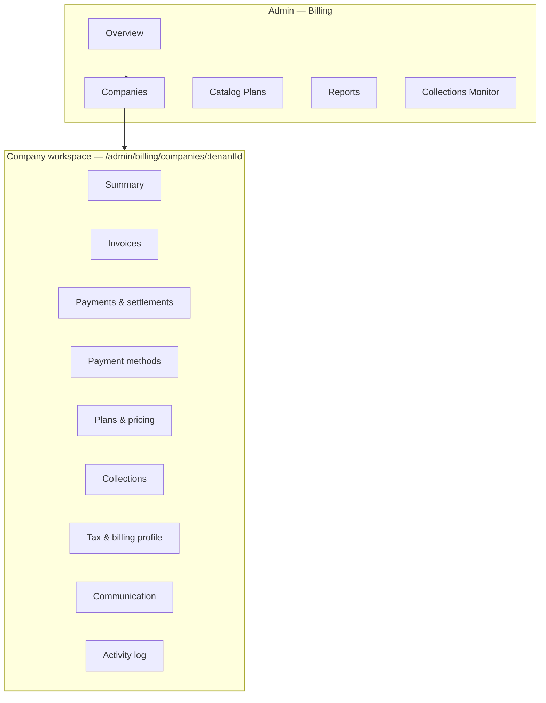
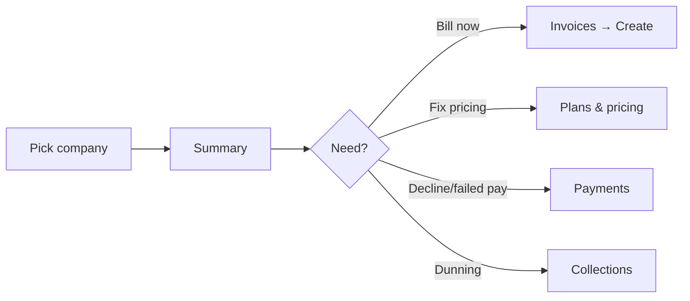
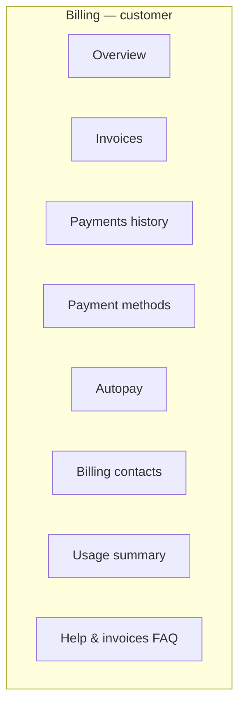
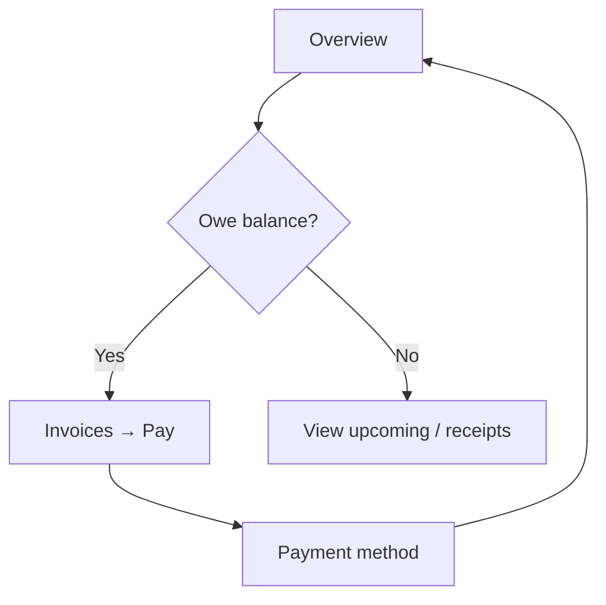

# Billing UX overhaul — Phase 1: Information architecture & flow

> **Status:** Product / UX architecture only — **no implementation in this phase.**  
> **Constraints honored:** No backend billing logic, invoice math, SOLA, worker, webhooks, telephony, mobile, or CRM changes.  
> **Read first:** `CURSOR_START_HERE.md`, `BILLING.md`, `BILLING_OPERATOR_RUNBOOK.md`.

**Principles (non-negotiable)**  
- **Practical flow is king** — operators complete tasks in few clear steps.  
- **User-friendly is queen** — language and hierarchy match customer mental models.  
- **Trust over tooling** — tenant UI must not feel like an internal admin console.  
- **Phase 1 = IA + flows only** — not final visual polish.

---

## 1. Audit — current billing navigation & patterns

### 1.1 Route map (portal)

| Route | Primary audience | Role / gate | Main purpose today |
|-------|------------------|-------------|---------------------|
| `/admin/billing` | Platform | `SUPER_ADMIN` + `can_view_admin_billing` | Platform metrics, tenant rail, preview, **Generate invoice** / **Run this tenant**, link to settings, **monthly batch** |
| `/admin/billing/settings` | Platform | Same | Long page: tenant `?tenantId=`, pricing source, monthly pricing, **SOLA**, collections, scheduled plan, diagnostics, invoice preview, branding |
| `/admin/billing/plans` | Platform | Same | Catalog **BillingPlan** CRUD (create/edit/clone/deactivate) |
| `/admin/billing/invoices` | Platform | Same | Tabbed **Payment operations**: Invoices (heavy actions), Transactions, Reports, Collections |
| `/billing` | Tenant | Billing permissions | Balance, unpaid list, autopay summary, **estimated next invoice** preview, links |
| `/billing/invoices` | Tenant | `can_view_billing_invoices` | Invoice list, PDF, open/pay |
| `/billing/invoices/[id]` | Tenant | Same | Detail & pay path |
| `/billing/payments` | Tenant | `can_view_billing_payments` | Cards / payment methods |
| `/billing/receipts` | Tenant | `can_view_billing_receipts` | Paid receipts |
| `/billing/settings` | Tenant | `can_view_settings_billing` | **Reuses** `TenantBillingSettingsContent` |
| `/settings/billing` | Tenant | Same permission via settings section | **Same component** as `/billing/settings` — duplicate entry point |

**Sidebar (`navConfig.ts`)**  
- **Billing section:** Overview, Settings, Invoices, Payments, Receipts.  
- **Admin section:** Admin Billing, Admin Billing Settings (SUPER_ADMIN only).  
- **Settings section:** “Billing Settings” → `/billing/settings` (duplicate of billing → settings).

### 1.2 Tenant context patterns (confusing today)

1. **Global workspace switcher** (`TenantSwitcher`) — sets `cc-tenant-id` + `cc-admin-scope` (TENANT vs GLOBAL); drives `x-tenant-context` on API calls.  
2. **Admin Billing overview** — **separate** left-rail tenant list + `selectedTenantId` **local to the page** (not the same control as global switcher).  
3. **Admin Billing Settings** — URL `?tenantId=` + `<select>`; can disagree with global switcher if operator does not align them.  

**Problem:** Three ways to think about “which company” without a single source of truth in the admin mental model.

### 1.3 Where high-risk actions live today

| Action | Location | Risk |
|--------|----------|------|
| Monthly batch (all tenants) | `/admin/billing` bottom card | **High** — creates/charges per policy |
| Dry run batch | Same | Lower but still operator-sensitive |
| Generate invoice (single tenant) | `/admin/billing` preview card | **High** |
| Run this tenant (batch slice) | Same | **High** |
| Charge card, Mark paid, Void, Send invoice, Email link, SMS link | `/admin/billing/invoices` per row | **Very high** density |
| Assign plan, Reset to plan, pricing mode | `/admin/billing/settings` | Med/high — config + money-adjacent |
| Collections config save | Settings | Worker-adjacent (documented) |
| Tenant “Pay now” / card flows | `/billing/*` | Contextual; must stay simple |

### 1.4 Current flow problems (summary)

- **Fragmented navigation:** Admin jumps between Overview → Settings → Plans → Invoices with weak wayfinding; cross-links are button-style, not a coherent “company workspace.”  
- **Admin vs tenant mixed:** Copy on tenant pages sometimes references SOLA, platform concepts, or “contact support” patterns that feel operational; SUPER_ADMIN can land on `/billing` and see **tenant** chrome while also having **admin** destinations — easy to use the wrong surface.  
- **Too many undifferentiated actions:** Payment operations tab rows expose many equal-weight buttons (good for power users, exhausting for SaaS UX).  
- **Disconnected concepts:** “Catalog plans,” “billing settings,” and “invoice preview/diagnostics” are three destinations instead of one “this company’s pricing & billing posture” story.  
- **Duplicate settings entry:** `/billing/settings` ≡ `/settings/billing` — users book-mark one, docs mention another.  
- **Too many clicks:** To go from “this tenant owes money” to “adjust pricing plan” typically: Overview → pick tenant → Open billing settings → scroll long page; or Invoices tab → unrelated IA to pricing.  
- **Dead-end / liminal feelings:** Settings page stacks many cards (diagnostics, preview period, SOLA, collections…) without progressive disclosure — feels “under construction” even when feature-complete.  
- **Dangerous action overload:** Single view combines read-only auditing with irreversible/high-impact ops without mandatory step framing.

### 1.5 Duplicated or overlapping concepts

| Concept | Appears as |
|---------|------------|
| Company scope | Global switcher, admin overview rail, `?tenantId=` |
| “Billing settings” | Nav Billing, Nav Settings admin label overlap, tenant settings duplicate route |
| Invoice preview | Admin overview card, Admin settings card (period-based), Tenant overview “estimated next invoice” |
| Plans | Catalog Plans page vs Assign current plan vs Scheduled plan vs tenant row pricing |
| Reports | Tab under invoices vs CSV exports vs future dedicated reporting |
| Collections | Tab under invoices vs Collections block on settings |

### 1.6 Admin / tenant confusion points

- **SOLA / gateway** on admin settings is correct for platform; **must never** be the default tenant landing.  
- **Pricing diagnostics** and **implementation labels** (`billingPlanId`, FK, catalog mode) belong in **operator advanced** surfaces, not tenant copy.  
- **“Payment Operations”** name sounds internal; tenants never see it, but operators may conflate with `/billing/invoices`.  
- **Same `DetailCard` / admin shell** styling on `/billing` and `/admin/billing` increases “developer console” feel for customers.

---

## 2. Proposed admin billing architecture (information architecture)

### 2.1 Experience target

**“Select company → manage everything for that company in one place.”**

- **Persistent company selector** (sticky): always shows active company; changing it updates all sub-routes under the workspace (no silent mismatch with global switcher — ideally **one** mechanism).  
- **Platform-wide** items (catalog, global monitoring, cross-tenant reports) live **outside** the company workspace but share the same admin shell.  
- **Dangerous / batch** actions live in **Run & automation** (or similar), never mixed with day-to-day company review.

### 2.2 Site map (proposed)

**Note:** Exact path prefix (`/admin/billing/companies/[id]`) is illustrative; implementation may use query or layout groups — but **IA should present** as nested workspace, not flat siblings.

### 2.3 Admin primary navigation (labels — customer language)

| Top level | Purpose |
|-----------|---------|
| **Overview** | Cross-tenant health: balances, failures, cards missing, **no per-row destructive actions** (drill into company). |
| **Companies** | Searchable directory; pick company → enter workspace. |
| **Catalog plans** | Global price books (rename from “Catalog” in UI copy where users see it). |
| **Reports** | Aging, failed payments, exports — **not** buried as only a sub-tab of invoices. |
| **Collections monitor** | Cross-tenant dunning posture, queues, pauses — read-mostly + controlled actions. |

### 2.4 Company workspace — section intent

| Section | Primary job | Primary action (one) |
|---------|-------------|----------------------|
| **Summary** | At-a-glance balance, next invoice date, autopay, risk flags | **Open invoices** or **Review account** (single CTA) |
| **Invoices** | Register of invoices; status, amounts | **Create invoice** (secondary: view) — destructive ops in overflow / step flow |
| **Payments** | Transactions, declines, retries context | **View transaction** |
| **Payment methods** | Cards on file, default | **Manage methods** (link to gated flow) |
| **Plans & pricing** | Plan assignment, overrides, pricing mode, schedule changes | **Update pricing** (wizard) |
| **Collections** | Dunning state for **this** company | **Adjust collections** (few controls) |
| **Tax & billing profile** | Tax toggles, legal/invoice branding, billing contacts | **Save profile** |
| **Communication** | Email templates availability, outbound comms prefs (future); **not** raw SOLA keys | **Send reminder** (if product allows) |
| **Activity log** | Immutable narrative for auditors | *(read-only)* |

**SOLA / gateway** fits under **Tax & billing profile → Payment gateway** or **Advanced → Gateway** — collapsed by default, never homepage of workspace.

### 2.5 Admin workflow (happy path — mermaid)

### 2.6 Batch / platform automation (separate lane)

Isolate **Monthly billing run**, **dry run**, **per-tenant run** under **Overview → Automation** or **Run center** — with explicit confirmations, previews, and **no** adjacent per-invoice clutter.

---

## 3. Proposed tenant billing experience (information architecture)

### 3.1 Separation rule

Tenants never see: SOLA setup, gateway webhooks, pricing diagnostics, catalog management, assign/reset internals, admin collections tooling, implementation badges (`billingPlanId`, etc.), or cross-tenant tables.

### 3.2 Site map (proposed)

### 3.3 Route strategy (conceptual)

- **Single settings path:** Keep **`/billing/settings`** as canonical; **`/settings/billing`** → **301 redirect** or same layout with redirect for bookmarks (implementation phase — listed as merge).  
- **Receipts:** Either nested under Payments or kept as **`/billing/receipts`** with tabs inside **Payments** (“History” / “Receipts”) to reduce sibling sprawl — product call in Phase 4.

### 3.4 Tenant workflow (mermaid)

---

## 4. Practical UX rules (enforced across phases)

1. **One primary action per section** — secondary actions in **⋯** overflow or grouped **Actions** menu.  
2. **Grouped actions** — “Money movement” vs “Documents” vs “Account.”  
3. **Clear hierarchy** — H1 = place; first card = “what matters this week.”  
4. **Fewer modal chains** — prefer **side panel** for invoice detail; use **stepper** for dangerous flows.  
5. **No mystery buttons** — verb + object: **Pay invoice**, **Download PDF**, **Update autopay**.  
6. **Consistent naming** — “Billing plans” (customer), “Price catalog” (operator advanced) if distinction needed.  
7. **No duplicated tabs** — Reports should not only live under Invoices; Settings should not appear twice in nav.  
8. **No implementation details** in tenant copy — use “Your plan” not “billingPlanId.”  
9. **Dangerous actions** — confirm step + consequence summary + optional reason code (future).  
10. **Operator speed** — keyboard-friendly company search, recent companies, pinned tenants (future).

**Copy examples**

| Avoid | Prefer |
|-------|--------|
| Run this tenant | Run billing for this company… (in automation flow with confirm) |
| Catalog plans | Catalog plans (admin) / **Your plan** (tenant) |
| Payment Operations | **Invoices & payments** (admin company) or **Receivables** |
| Billing configuration (vague) | **Plans & pricing** / **Tax & invoicing** |

---

## 5. UI component strategy (design language — Phase 2+)

Not pixel-perfect in Phase 1 — **patterns** to implement later:

| Pattern | Use |
|---------|-----|
| **Sticky company selector** | Admin workspace header; sync with tenant context. |
| **Command bar** | Context actions: `Create invoice`, `Export`, `Filter` — not 8 equal buttons per row. |
| **Summary strip** | 3–4 KPIs max on company Summary; link to detail. |
| **Grouped settings panels** | Accordion or left sub-nav within **Tax & billing profile**; avoid one endless scroll. |
| **Step-based dangerous flows** | Charge, void, mark paid, batch run — stepper + recap. |
| **Tables** | Row click → **side panel**; bulk actions in header. |
| **Status chips** | Invoice state, payment state, dunning state — consistent color system. |
| **Empty states** | One illustration line + one CTA (“Add payment method”). |
| **Loading** | Skeletons for tables/cards; no layout jump. |

**Avoid:** walls of `DetailCard` without grouping, random yellow warning strips, exposing internal enums, repeating the same preview in three places without telling the user they’re the same.

---

## 6. Current vs proposed — flow comparison

| Dimension | Today | Proposed Phase 2+ |
|-----------|-------|-------------------|
| Company focus | Splintered (switcher vs rail vs `?tenantId=`) | **One sticky selector** backing all admin company routes |
| Admin IA | Flat list of URLs | **Hub + company workspace** + global catalog/reports |
| Settings | Mega-page | **Split by workflow** inside company + Advanced drawers |
| Invoices ops | Many row buttons | **Row → panel**; primary/overflow; steppers for danger |
| Tenant IA | Mirrors admin shell cues | Distinct **customer** layout & copy |
| Duplicate routes | `/billing/settings` + `/settings/billing` | **Single canonical** + redirect |
| Reports | Nested under invoices | **Top-level Reports** for admin |
| Batch run | Embedded on overview | **Automation** lane with guardrails |

---

## 7. Top 15 UX issues (ranked by severity)

1. **Conflicting tenant selection** (global switcher vs admin rail vs URL) — causes wrong-scope actions and support burden.  
2. **Dangerous action density** on `/admin/billing/invoices` — accidental charge/void/SMS risk.  
3. **No clear “company home” for operators** — overview is hybrid platform + tenant + outbound links.  
4. **Settings page cognitive overload** — expert features (diagnostics, SOLA, collections, assign, reset) in one vertical scroll.  
5. **Tenant/admin visual parity** — `billing-admin-shell` / shared components make tenant UX feel operational.  
6. **Duplicate tenant settings routes** — navigation and docs drift.  
7. **Reports & collections trapped** under invoice tabs — discovery and IA are wrong for strategic work.  
8. **Naming** (“Payment Operations”, “Catalog plans”) — internal language breaks trust.  
9. **Multiple invoice preview surfaces** without explaining relationship — “which number is truth?”  
10. **Platform batch run proximity** to per-tenant actions — fat-finger risk.  
11. **Weak wayfinding** between Plans, Settings, and Invoices for one company — too many clicks.  
12. **SOLA exposed** in hero metrics on admin overview — should be de-emphasized or moved to Advanced.  
13. **No progressive disclosure** for gateway/tax/dunning — everything looks equally important.  
14. **Transaction vs invoice mental model** split across tabs without guidance — power feature, needs framing.  
15. **Empty / edge states** — “under construction” vibe when data is sparse (no cards, long legal copy).

---

## 8. Phased implementation plan (recommended)

| Phase | Scope | Outcome |
|-------|--------|---------|
| **Phase 1 (done)** | IA + flows + this document | Alignment before code |
| **Phase 2** | **Navigation + layout shell** | New admin billing nav model, sticky company selector contract, route placeholders, redirect plan, tenant layout differentiation (shell only) |
| **Phase 3** | **Admin company workspace** | Move/re-skin existing admin features into Summary / Plans & pricing / Tax & profile sections; reduce long settings page |
| **Phase 4** | **Tenant billing redesign** | Overview, invoices, payments, settings consolidation, copy pass, remove admin patterns |
| **Phase 5** | **Invoice / payment UX polish** | Side panels, steppers, action hierarchy, PDF/pay flows |
| **Phase 6** | **Collections & reporting UX** | Dedicated admin surfaces, dashboards, fewer nested tabs |

**Dependencies:** Phase 2 should define **URL scheme and selector state** so Phase 3 does not re-refactor routes.

---

## 9. Files likely impacted (implementation phases — not now)

**Navigation & layout**

- `apps/portal/navigation/navConfig.ts`  
- `apps/portal/components/` — shell, sidebar, headers (e.g. layout wrapping `(platform)`)

**Admin billing**

- `apps/portal/app/(platform)/admin/billing/page.tsx`  
- `apps/portal/app/(platform)/admin/billing/settings/page.tsx`  
- `apps/portal/app/(platform)/admin/billing/plans/page.tsx`  
- `apps/portal/app/(platform)/admin/billing/invoices/page.tsx`  
- `apps/portal/app/(platform)/admin/billing/_components/tenantBillingConfigForms.tsx`  
- New (Phase 2/3): e.g. `admin/billing/companies/[tenantId]/layout.tsx` + segment `page.tsx` files (illustrative)

**Tenant billing**

- `apps/portal/app/(platform)/billing/page.tsx`  
- `apps/portal/app/(platform)/billing/invoices/page.tsx`  
- `apps/portal/app/(platform)/billing/invoices/[id]/page.tsx`  
- `apps/portal/app/(platform)/billing/payments/page.tsx`  
- `apps/portal/app/(platform)/billing/receipts/page.tsx`  
- `apps/portal/app/(platform)/billing/settings/page.tsx`  
- `apps/portal/app/(platform)/billing/TenantBillingSettingsContent.tsx`  
- `apps/portal/app/(platform)/settings/billing/page.tsx` (redirect / thin wrapper)

**Shared**

- `apps/portal/components/DetailCard.tsx`, `PageHeader.tsx`, table/modal primitives  
- Permissions / gates: `PermissionGate`, `useAppContext`, `permissionMap` (copy/visibility only — no backend role changes assumed)

---

## 10. Routes — stay, merge, redirect (proposal)

| Route | Recommendation |
|-------|----------------|
| `/admin/billing` | **Stay** as cross-tenant **Overview**; slim down tenant-specific clutter over time → link into company workspace |
| `/admin/billing/settings` | **Merge** into company workspace sections; interim **redirect** from old URL with `tenantId` to new paths (Phase 3) |
| `/admin/billing/plans` | **Stay** as global **Catalog plans** (optional rename in UI only) |
| `/admin/billing/invoices` | **Split**: company-level invoices → workspace **Invoices**; cross-tenant **Reports** / **Collections monitor** → top-level IA |
| `/billing` | **Stay** — tenant Overview |
| `/billing/invoices`, `/billing/invoices/[id]` | **Stay** |
| `/billing/payments`, `/billing/receipts` | **Stay** short term; evaluate **merge** under Payments hub in Phase 4 |
| `/billing/settings` | **Canonical** tenant billing settings |
| `/settings/billing` | **Redirect** to `/billing/settings` (301 or client redirect) |

**New (conceptual):** `/admin/billing/companies` (directory), `/admin/billing/companies/[tenantId]/…` for workspace subtrees.

---

## 11. SaaS inspiration references (patterns, not copy)

Use these as **interaction references** — not screenshots to clone.

| Reference | Borrow |
|-----------|--------|
| **Stripe** | Connected account / customer-centric navigation; danger actions behind clear intent; immutable activity timeline |
| **Shopify Billing** | Plan + usage clarity; merchant-friendly summaries; segmented “Settings vs Orders” |
| **OpenPhone** | Simple telecom-adjacent billing tone; restrained admin; trust-forward empty states |
| **Slack** | Workspace switcher metaphor; predictable settings depth; restrained use of jargon on bill-to views |
| **Modern B2B SaaS admin** | Sticky context bar, tables + drawer pattern, progressive disclosure for “Advanced” |

---

## 12. Open decisions (resolve in Phase 2 kickoff)

1. **Company workspace URL** — nested path vs `(admin-billing-layout)` + query param persistence.  
2. **Relationship to global `TenantSwitcher`** — unify vs explicit “Billing operator scope” toggle.  
3. **Receipts IA** — sibling route vs Payments sub-area.  
4. **Communication** tab scope — transactional email only vs future SMS billing notices.  
5. **Feature flags** — roll out IA behind flag for SUPER_ADMIN cohort (optional).

---

## Phase 2 implementation notes (2026-05)

**Decisions (implemented):**

1. **Company workspace URL** — Kept existing routes (`/admin/billing`, `/admin/billing/settings`, `/admin/billing/invoices`, `/admin/billing/plans`). **Persistent company context** uses **`?tenantId=`** on those pages (plus **`sessionStorage`** key `adminBillingTenantId` as a fallback when the URL omits it). **No** new nested `/admin/billing/companies/...` routes in this phase.
2. **Invoices sub-tabs** — Persisted in the URL as **`opsTab=invoices|transactions|reports|collections`** (Invoices & payments page; the **Payments** tab label maps to `transactions` in the API).
3. **Settings deep links** — **`billingSection=plans-pricing|collections|tax-billing|gateway|preview|pricing-explanation`** scrolls to anchored sections on `/admin/billing/settings`; section ids are `billing-section-*` in the DOM.
4. **Layout shell** — `(platform)/admin/billing/layout.tsx` wraps all admin billing pages in **`AdminBillingShell`**: sticky header, searchable company picker, workspace pill nav, quick links. **`/admin/billing/plans`** runs in **catalog mode** (picker hidden; “Back to company billing” returns with last `tenantId`).
5. **Tenant vs admin** — Tenant **`TenantBillingSettingsContent`** is invoice-presentation focused; gateway setup copy and configuration live under **admin** only (see portal implementation).

**Primary files:** `layout.tsx`, `_components/AdminBillingShell.tsx`, `_components/adminBillingLinks.ts`, plus the four existing admin billing `page.tsx` files and `tenantBillingConfigForms.tsx` (UI labels only).

---

*Document maintainer: product/design + owning engineer for billing portal. Update when IA changes before implementation.*
