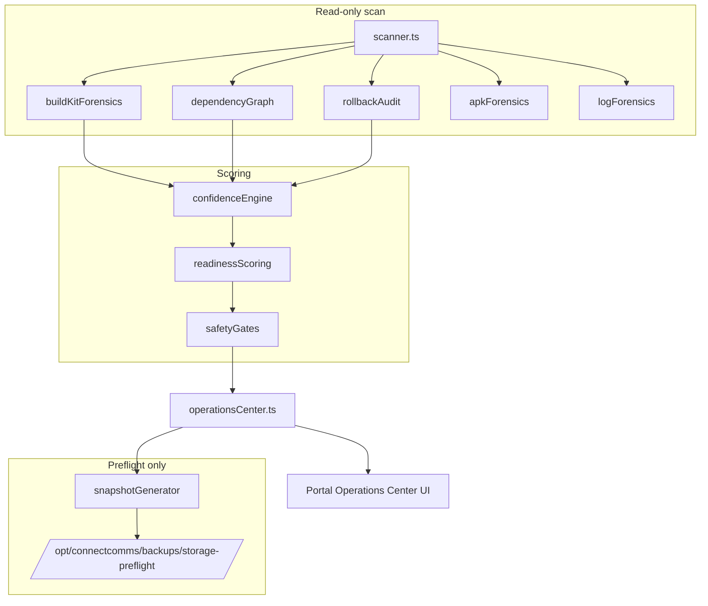

# STORAGE_MAINTENANCE

> Safe storage cleanup controller for Connect production hosts.
> **Phase 5 (current):** Controlled staged cleanup executor when `STORAGE_CLEANUP_ENABLED=1`.
> Phases 1–4 remain read-only by default. Execution requires pre-cleanup snapshot, health gate, plan approval, and per-stage POST.

Read `SERVER_OPERATIONS.md` for the 2026-06-14 forensic baseline and `AGENTS.md` for forbidden server commands.

---

## Architecture

```
Portal /admin/storage-health
        │
        ▼
API  /admin/storage-health/*
        │
        ├── hostVisibility (mount probes, Docker API GET whitelist)
        ├── scanner (read-only: disk, docker, containerd, APKs, logs)
        ├── classifier (PROTECTED / ACTIVE / ROLLBACK / SAFE / UNKNOWN)
        ├── dashboard (KPIs, distribution, consumers, simulation, trends)
        ├── planBuilder (dry-run commands, command guard)
        ├── auditLog (in-memory ring buffer)
        ├── proofSystem/ (Phase 2 — forensics, dependency graph, confidence, readiness)
        │     ├── buildKitForensics.ts
        │     ├── dependencyGraph.ts
        │     ├── rollbackAudit.ts
        │     ├── apkForensics.ts
        │     ├── logForensics.ts
        │     ├── confidenceEngine.ts
        │     ├── readinessScoring.ts
        │     ├── safetyGates.ts
        │     ├── snapshotGenerator.ts
        │     └── operationsCenter.ts
        └── cleanupExecutor/ (Phase 5 — gated staged cleanup when STORAGE_CLEANUP_ENABLED=1)
              ├── healthGate.ts
              ├── inventoryFingerprint.ts
              ├── buildKitInvestigation.ts
              ├── commandRunner.ts
              ├── stages.ts
              ├── preCleanupSnapshot.ts
              └── executor.ts
```

### Phase 1.6 — Host visibility layer (read-only)

The API container previously could not see host storage (no `docker.sock`, no host paths).
Phase 1.6 adds **read-only inventory mounts** on `api` and `api_candidate` in `docker-compose.app.yml`:

| Host path | Container mount | Mode |
|-----------|-----------------|------|
| `/var/run/docker.sock` | `/var/run/docker.sock` | `ro` |
| `/var/lib/containerd` | `/host-inventory/var/lib/containerd` | `ro` |
| `/opt/connectcomms` | `/host-inventory/opt/connectcomms` | `ro` |
| `/var/log` | `/host-inventory/var/log` | `ro` |
| `/opt/connectcomms/backups/storage-preflight` | `/var/lib/connect/storage-preflight` | `rw` (JSON snapshots only) |

`STORAGE_HOST_INVENTORY_ROOT=/host-inventory` remaps scanner config paths so the UI displays
familiar host paths (`/var/lib/containerd`, `/opt/connectcomms/...`) via `toHostDisplayPath()`.

```mermaid
flowchart LR
  subgraph host [Production host]
    DS[docker.sock]
    CTD[/var/lib/containerd]
    CC[/opt/connectcomms]
    LOG[/var/log]
  end
  subgraph api [API container]
    HV[hostVisibility.ts]
    SC[scanner.ts]
    DD[dockerDeps.ts]
  end
  DS -->|GET /system/df only| DD
  CTD -->|du -sb ro mount| SC
  CC -->|du -sb ro mount| SC
  LOG -->|du -sb ro mount| SC
  HV --> SC
  DD --> SC
```

**Docker inventory:** HTTP `GET` over the Unix socket — no `docker` CLI required.
Allowed paths are whitelisted in `hostVisibility.ts` (`/system/df`, `/images/json`, `/images/{id}/json`, `/containers/json`, `/volumes`, `/info`, `/version`).
Any other path throws `storage_host_visibility_forbidden_docker_path`.

**Filesystem sizing:** `du -sb` on mounted inventory paths (180s timeout for large trees like containerd).

**Containerd breakdown:** overlay snapshots (`io.containerd.snapshotter.v1.overlayfs`) and content blobs (`io.containerd.content.v1.content`) reported separately.

### Security model (read-only guarantees)

| Layer | Guarantee |
|-------|-----------|
| Compose mounts | All host inventory mounts are `:ro` — kernel-enforced read-only |
| Docker API | Code-level GET whitelist; no POST/DELETE/prune endpoints callable |
| Scanner | No `rm`, `prune`, `truncate`, `journalctl --vacuum`, or write syscalls |
| HTTP routes | `POST /approve` → **501**, `POST /execute` → **403** (unchanged) |
| Plan validator | Rejects wildcard and destructive commands (Phase 1) |

**Caveat:** A read-only `docker.sock` mount still exposes the full Engine API at the socket level.
Mitigation is the application whitelist plus super-admin JWT on all `/admin/storage-health/*` routes.
A compromised API process could theoretically bypass the whitelist — treat socket access as privileged.

### Limitations (Phase 1.6)

- First scan after deploy may take **1–3 minutes** while `du` walks ~500 GB containerd tree.
- Disk totals use container root filesystem (`df`) — may differ slightly from host `df` on `/`.
- Growth trends require multiple scans over time (in-memory history ring).
- Worker/telephony hosts are not scanned — app host only.
- Build cache reclaimable estimate depends on Docker Engine `/system/df` reclaimable flags.
- **Containerd `du` walks take 15–20 minutes** on production (~500 GB trees). First scan after deploy may leave overlay/total null until the 20-minute path timeout completes; subsequent scans reuse in-memory results until the API container restarts.

### API routes (super-admin JWT)

| Method | Path | Phase 1 behavior |
|--------|------|------------------|
| GET | `/admin/storage-health` | Dashboard snapshot: KPIs, distribution, trends, alerts |
| POST | `/admin/storage-health/scan` | Run read-only inventory |
| GET | `/admin/storage-health/history` | Scan trend rows |
| GET | `/admin/storage-health/audit` | Audit events |
| POST | `/admin/storage-health/plan` | Generate dry-run cleanup plan |
| GET | `/admin/storage-health/plan` | Latest plan |
| POST | `/admin/storage-health/snapshot` | **202** — write read-only preflight JSON to host (no restore/cleanup) |
| POST | `/admin/storage-health/approve` | **501** — not implemented |
| POST | `/admin/storage-health/execute` | **403** — forbidden |
| GET | `/admin/storage-health/executions` | Empty (execution phase) |

Permission: `can_view_admin_storage_health` (super-admin via `can_manage_global_settings`).

Future approval: `can_approve_storage_cleanup` (reserved, unused in Phase 1).

---

## Classifications

| Class | Meaning |
|-------|---------|
| `PROTECTED_NEVER_DELETE` | Production data, env, backups policy, protected volumes |
| `ACTIVE_REQUIRED` | Running containers, attached volumes, active images |
| `ROLLBACK_CANDIDATE` | `*_candidate` images — manual policy before removal |
| `SAFE_CANDIDATE` | BuildKit cache, old APKs, trimmable logs (future) |
| `UNKNOWN_REQUIRES_REVIEW` | Blocks automated cleanup until human review |

---

## Hard protection rules (enforced in code)

Never delete / never target in cleanup commands:

- `/opt/connectcomms/data` (Postgres, Redis, MinIO)
- `/opt/connectcomms/env`
- `/opt/connectcomms/backups` (unless separate future policy)
- Protected Docker volumes: `app_chat-attachments`, `app_crm-*`, `app_ivr-prompts`, `app_moh-assets`, `obs_*`
- Bind mounts used by running containers
- Active Docker images and running containers
- CRM documents, chat attachments, voicemail drops, IVR prompts, MOH assets

### Forbidden commands (plan validator rejects)

- `rm -rf`, `find -delete`, `truncate`, `shred`
- `docker system prune`, `docker volume prune`, `docker system prune --volumes`
- Wildcards (`*`)

---

## Reclaim simulation (Phase 1 plan only)

The plan builder proposes **explicit commands** with **dry-run counterparts**:

| Category | Example dry-run command | Execution |
|----------|-------------------------|-----------|
| BuildKit cache | `docker builder prune --filter until=336h --dry-run` | Phase 2 + approval |
| Unused images | `docker image inspect <id>` | Phase 2 + approval |
| Old APKs | `ls -la <exact-path>` | Phase 2 + approval |
| Monitoring logs | `find … -print` only (no delete in Phase 1) | Phase 2 + approval |
| journald | `journalctl --disk-usage` | Phase 2 + approval |

Plans are **blocked** when:

- Any `UNKNOWN_REQUIRES_REVIEW` item exists in the scan
- Any protected path appears in a command
- Any forbidden command pattern is detected
- Rollback candidates are included without explicit approval policy

---

## Alerts (thresholds via env)

| Alert | Default threshold |
|-------|-------------------|
| Disk warning / critical | 70% / 80% |
| containerd warning / critical | 300 GB / 400 GB |
| BuildKit warning / critical | 200 GB / 400 GB |
| Free space warning / critical | 50 GB / 20 GB |

Env vars: `STORAGE_DISK_WARNING_PCT`, `STORAGE_BUILDKIT_CRITICAL_BYTES`, etc. (see `dockerDeps.ts`).

---

## Phase 2 — Proof, dependency analysis, and pre-cleanup readiness (read-only)

Phase 2 adds an **Operations Center** on `/admin/storage-health` that answers what consumes storage, what depends on it, what is safe/unsafe, and whether cleanup should be blocked — **without executing any cleanup**.



### Build cache analysis (Phase A)

Per BuildKit cache entry from Docker `GET /system/df` JSON:

| Field | Source |
|-------|--------|
| cache ID, size, created/last-used, age | `BuildCache[]` in `/system/df` |
| build stage / Dockerfile | `Description` field when present |
| referenced by active image / running container / rollback | dependency graph + image inspect |
| confidence score | `confidenceEngine.ts` |

Dashboard totals: **Total Entries**, **Total Size**, **Referenced Size**, **Unused Size**, **Unknown Size**. Any **Unknown** size automatically blocks cleanup readiness.

### Dependency graph (Phase B)

Maps **Container → Image → Layers → Build cache** for all running services (`api`, `portal`, `worker`, `telephony`, `realtime`, `postgres`, `redis`, `minio`, `grafana`, `loki`, `prometheus`, `kamailio`, `rtpengine`, and others). Anything referenced by a running container is classified **`ACTIVE_REQUIRED`**.

### Rollback coverage (Phase C)

Inventories active, candidate, and superseded deploy images per core service. Classifications: `ACTIVE_REQUIRED`, `ROLLBACK_CANDIDATE`, `SAFE_CANDIDATE`, `UNKNOWN`. Dashboard shows per-service rollback availability (API, Portal, Worker, Telephony, …).

### APK forensics (Phase D)

Read-only inventory of `/opt/connectcomms/downloads`: filename, size, build date, version, latest vs historical, referenced-by-download-page flag.

### Log forensics (Phase E)

Read-only sizing of `/var/log`, `/opt/connectcomms/monitoring/logs`, and other configured log roots: total size, oldest/newest file, estimated growth rate.

### Preflight snapshot system (Phase F)

`POST /admin/storage-health/snapshot` queues async generation of a timestamped JSON bundle under:

`/opt/connectcomms/backups/storage-preflight/<ISO-timestamp>/`

Contents: docker images/containers/volumes inventory, dependency graph, rollback inventory, reclaim candidates, protected assets, operations-center summary. **No restore actions. No cleanup.**

Env: `STORAGE_PREFLIGHT_SNAPSHOT_ROOT` (default `/var/lib/connect/storage-preflight` in container).

### Confidence engine (Phase G)

Every cleanup candidate receives a score and label:

| Score | Label | Meaning |
|-------|-------|---------|
| ≥ 99.9% | `SAFE` | Not referenced by container, image, or rollback; fully understood |
| ≥ 95% | `LIKELY_SAFE` | Minor uncertainty |
| < 95% | `REVIEW_REQUIRED` | Human review before any future action |
| — | `BLOCKED` / `UNKNOWN` | Missing dependency data — blocks readiness |

Criteria: not referenced by container/image/rollback, not used recently, classification complete.

### Cleanup readiness score (Phase H)

Informational 0–100% score with label (`READY FOR REVIEW`, `BLOCKED`, `HIGH RISK`). Factors: unknown assets, active references, rollback coverage, snapshot availability, dependency completeness, confidence distribution. **Does not enable cleanup.**

### Safety gates (Phase I)

Readiness is automatically **blocked** when any of:

- Unknown assets exist (unknown BuildKit size, unmapped containers, `UNKNOWN` classifications)
- Dependency graph incomplete (missing image inspect, scan in progress)
- No preflight snapshot on disk
- Rollback inventory missing for a core service
- Mean confidence below threshold
- Protected asset appears in candidate set

Dashboard lists exact blocking reasons.

### Future execution phase (not implemented)

- Approval token issuance (`can_approve_storage_cleanup`)
- Pre/post service health checks
- Audited execution of **non-blocked** plan actions only
- Persistent execution history

---


## Phase 1.5 operations dashboard

Portal `/admin/storage-health` answers in under 10 seconds (after initial slow scan):

| Question | Source |
|----------|--------|
| Total / used / free disk | `dashboard.totalDiskBytes`, `usedBytes`, `freeBytes` |
| Build cache & reclaimable | `buildCacheBytes`, `reclaimableBytes` |
| Containerd total / overlay / blobs | `containerdBytes`, `containerdOverlayBytes`, `containerdContentBytes` |
| Protected data total | `protectedDataBytes` |
| Risk level | `riskLevel` (low / medium / high / critical) |
| Largest consumers (top 20) | `largestConsumers[]` (host paths, not mount prefixes) |
| Distribution by category | `distribution[]` (Build Cache, Application, Downloads, Logs, Database, Redis, Docker Volumes, Other) |
| Protected assets | `protectedAssets[]` |
| Reclaim simulation | `projectedUsageAfterCleanupBytes`, `projectedRecoveryBytes` (estimate only) |
| Disk trend | `trends[]` windows 24h / 7d / 30d with direction |
| Cleanup readiness | `cleanupReadiness[]` (eligible / review / blocked) |
| Host visibility status | `scan.hostVisibility` — mount and docker.sock probe |

API module: `apps/api/src/ops/storageMaintenance/dashboard.ts`

Execution remains blocked: approve **501**, execute **403**.

---

## Verification

```bash
pnpm --filter @connect/api exec node --experimental-test-module-mocks --import tsx --test "src/ops/storageMaintenance/*.test.ts"
```

Portal: `/admin/storage-health` → Scan Now → Cleanup Plan (read-only).

---

## Phase 5 — Controlled cleanup executor

**Enable:** `STORAGE_CLEANUP_ENABLED=1` on `api` / `api_candidate` (default `0` in `docker-compose.app.yml`).

**Workflow (strict order):**

1. **Scan Now** — inventory + operations center (0 unknowns, gates PASS).
2. **Generate Snapshot** — preflight proof JSON.
3. **Cleanup Plan** — dry-run actions.
4. **Prepare Cleanup** — `POST /admin/storage-health/prepare-cleanup` writes `storage-precleanup-<ts>.json`, runs health gate (14 services).
5. **Approve** — `POST /admin/storage-health/approve` with `{ planId }`.
6. **Execute stages individually** — `POST /admin/storage-health/execute` with `{ stage: 1|2|3|4 }`.

| Stage | Target | Method |
|-------|--------|--------|
| 1 | `postgres:16-alpine` | `docker image rm` |
| 2 | Historical APKs (keep 5) | Ephemeral `alpine` container with rw bind on `/opt/connectcomms/downloads` |
| 3 | systemd journal | Privileged `chroot` journal vacuum to 1G |
| 4 | BuildKit cache | `docker builder prune --filter unused-for=<retention>` after investigation |

**Stop conditions:** health gate fail, unknown assets, safety gates blocked, inventory fingerprint drift (containers/volumes/rollback images), command failure.

**BuildKit investigation:** `GET /admin/storage-health/investigation/buildkit` — per-entry inventory from Docker Engine `GET /system/df` JSON (not host `docker` CLI inside the API container). Explains confidence &lt; 99 (incomplete `*` entries, cumulative layer accounting).

**Phase 5B — BuildKit inventory visibility (2026-06-14):**

| Symptom | Root cause | Fix |
|---------|------------|-----|
| Host `docker system df -v` shows ~535 GB | Works on host | — |
| API investigation returned 0 entries | (1) `GET /system/df` took ~90s with 2,781 entries but HTTP client timeout was 30s; (2) investigation path called `docker system df -v` CLI but API image has no `docker` binary | `STORAGE_DOCKER_SYSTEM_DF_TIMEOUT_MS` default **600000** (10 min); collector uses socket HTTP API only; single deduped fetch per scan |

**Inventory status** (`OK` | `UNAVAILABLE` | `PERMISSION_DENIED` | `PARSE_FAILED` | `TIMEOUT`) surfaced on `GET /admin/storage-health` → `buildKitInventory` and portal **BUILDKIT INVENTORY (PHASE 5B)** panel.

**Rules:** `safeToPrune` stays **false** unless `inventoryStatus === OK` and per-entry parse succeeded. BuildKit prune actions in dry plan are **blocked** when inventory incomplete. Cleanup remains gated behind Prepare → Approve → Execute.

**Env:** `STORAGE_DOCKER_SYSTEM_DF_TIMEOUT_MS` (optional, default `600000`).

**Never targeted:** protected data, running images, candidate rollback images, containerd content blobs, `/opt/connectcomms/app`, CRM/chat volumes.

---

## Source files

| Path | Role |
|------|------|
| `apps/api/src/ops/storageMaintenance/types.ts` | Types + config |
| `apps/api/src/ops/storageMaintenance/protectionRules.ts` | Hard guards |
| `apps/api/src/ops/storageMaintenance/classifier.ts` | Classification |
| `apps/api/src/ops/storageMaintenance/hostVisibility.ts` | Mount probes, Docker GET whitelist, display path remap |
| `apps/api/src/ops/storageMaintenance/dockerSystemDfApi.ts` | Parse Docker Engine `/system/df` JSON |
| `apps/api/src/ops/storageMaintenance/buildKitInventory.ts` | Phase 5B — BuildKit cache collector (socket API, fallbacks, status) |
| `apps/api/src/ops/storageMaintenance/dockerDeps.ts` | Production deps: HTTP docker API, `du` sizing, config |
| `apps/api/src/ops/storageMaintenance/scanner.ts` | Read-only inventory (containerd breakdown) |
| `apps/api/src/ops/storageMaintenance/dashboard.ts` | KPIs, distribution, simulation, trends |
| `apps/api/src/ops/storageMaintenance/planBuilder.ts` | Dry-run plan |
| `apps/api/src/ops/storageMaintenance/alerts.ts` | Threshold alerts |
| `apps/api/src/ops/storageMaintenance/auditLog.ts` | Audit ring buffer |
| `apps/api/src/ops/storageMaintenance/proofSystem/*` | Phase 2 forensics, scoring, snapshots |
| `apps/api/src/ops/storageMaintenance/cleanupExecutor/*` | Phase 5 staged executor |
| `apps/api/src/ops/storageMaintenance/routes.ts` | HTTP routes |
| `apps/portal/app/(platform)/admin/storage-health/page.tsx` | Operations Center UI |
